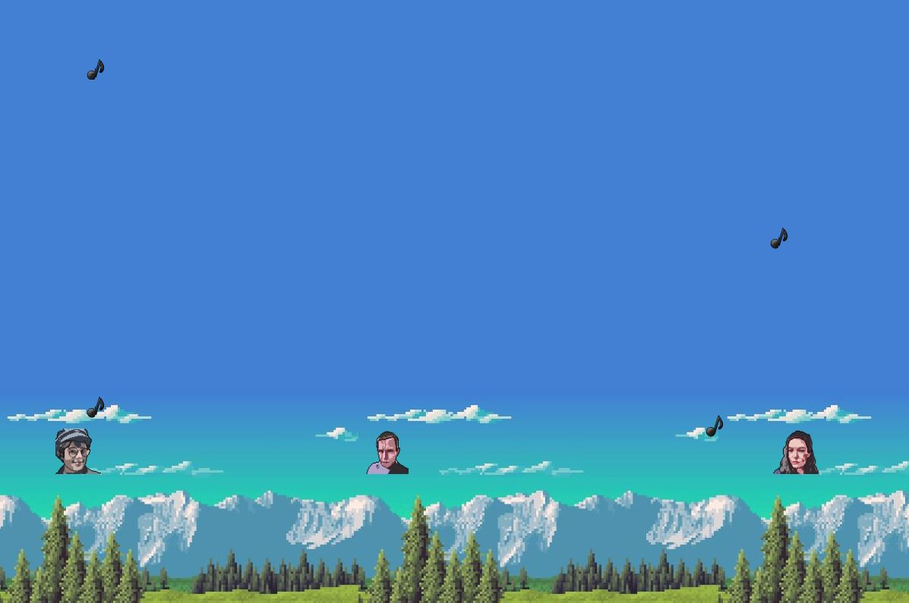

# organ-fight

## Contexte

Le jeu Organ-fight a été développé dans le cadre du module CSC 4526 – Développement C++ donné à l'école d'ingénieur Télécom SudParis. Il a été dévellopé entre le 23 mai 2022 et le 9 Juin 2022.  
Le thème était 
>Développez un jeu inspiré d'un livre de Jules Verne.  

Nous étions 2 à travailler sur ce projet:  
	[Chloé Hennequin](https://github.com/Skizaat)  
	[Paul VANCAUWENBERGHE](https://github.com/PaulVnc)

Sous la supervision et l'encadrement de:  
	[Loïc Joly](https://github.com/JolyLoic)  
	[Michel Simatic](https://github.com/simatic)

## Le Jeu

Le jeu organ-fight s'inspire de la nouvelle de Jules Vernes [Monsieur Ré-dièze et mademoiselle Mi-bémol](https://www.julesverne.ca/jv.gilead.org.il/zydorczak/Redieze-fr.html).

Dans ce jeu multijoueur local, vous incarnez Monsieur Ré Dièze et Madame Mi Bémol qui ont décidé de surmonter leur peur du maitre organiste Effarane ! Vous profitez donc des réparations de l'orgue du village pour vous caher et envoyer des notes de musique sur l'effrayant maître Effarane. Et qui sais, peut être que si vous en envoyez suffisamment, il s'énervera et quittera le village !

## Les Commandes

Joueur 1: (à gauche de l'écran)  
  
Z: permet de déplacer le personnage vers le haut  
W: permet de déplacer le personnage vers le bas  
S: permet de renvoyer les notes qui tombent devant le personnage vers le Boss, au milieu de l'écran

Joueur 2: (à droite de l'écran)  
  
U: permet de déplacer le personnage vers le haut  
N: permet de déplacer le personnage vers le bas  
H: permet de renvoyer les notes qui tombent devant le personnage vers le Boss, au milieu de l'écran

### Crédits

* La musique utilisée reprend la mélodie de la chanson "Can you feel the love tonight/L'amour brille sous les étoiles" issue du film Le Roi Lion, composée par Elton John.
* L'image utilisée pour le background provient du site internet [wallup.net](https://wallup.net/retro-games-mountain-8-bit/).
* Les assets des 2 joueurs et du Boss sont des versions pixélisées par le site [pixel.me](https://pixel-me.tokyo/en/) de personnes proches des dévellopeurs. Iels ont donné leur accord pour que leur image soit utilisée dans le jeu.